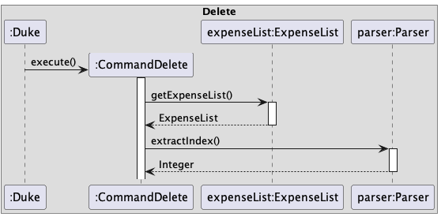
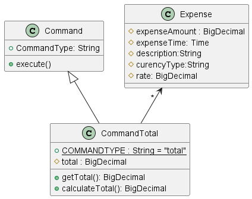

# Developer Guide

## Acknowledgements

List here sources of all reused/adapted ideas, code, documentation, and third-party libraries
with links to the original sources included.

* [JSON-java](https://github.com/stleary/JSON-java)
* [three-ten-extra](https://www.threeten.org/threeten-extra/)
* [Requesting and Parsing of data from API into Java](https://www.youtube.com/watch?v=lDEfoSwyYFg)
* [Gson Type Adaptor](https://www.youtube.com/watch?v=Gf-Hx-Q0rOs)

## Design & implementation
{Describe the design and implementation of the product. Use UML diagrams and short code snippets where applicable.}
## Design

Our main `Duke` class is responsible for the instantiation and launch of our application.  
Our overall project design is split into 5 components, `command`, `common`,`data`, `storage` and `parser`.
 - `command`: The command executor.
 - `data`: Holds data and data structures of our application.
 - `parser`: Reads data from the user input and parses it into an 'executable' command.
 - `common`: Holds mainly static data that is used by multiple components.
 - `storage`: Handles the reading and storing of our data.

## Implementation
### 'Add' feature
This mechanism is facilitated by `CommandAdd`, which extends `Command`, as well as `ParserAdd`. `ParserAdd` parses the 
user input into a string of words `parsedInput[]` which `CommandAdd` then stores internally. `CommandAdd` also stores an 
internal reference to the list of expenses `expenseList` to be added to.

`CommandAdd` implements the following operations:
 - `CommandAdd#execute()` -- Instantiates the `Expense` object with the parsed inputs and adds it to `expenseList`
 - `CommandAdd#roundInput(amount)` -- Rounds the expense amount to 2 decimal places. 

`ParserAdd` implements the following operations:
 - `ParserAdd#parseInput(userInput)` -- Parses the user input into an array of strings for `CommandAdd` to read.
 - `ParserAdd#checkType(input)` -- Checks the type of the input corresponding to its index.
 - `ParserAdd#substringIndex(type)` -- Returns the substring index of the start of the user input.

The `CommandAdd#execute()` operation is exposed in the main `Duke` class, while the operations in `ParserAdd` are
exposed in the `Parser` class.

Given below is an example usage of the feature.

Step 1. The user executes `add amt/24 t/02-02-2012` as the `userInput` to add a new `Expense` into the the list of 
expenses. `Duke` calls `Parser#extractCommandKeyword(userInput)` to parse the input and determines that the `add` command is called.

Step 2. `Duke` instantiates a new `CommandAdd` and calls `CommandAdd#execute()`, which in turn calls 
`Parser#extractAddParameters(userInput)` and `ExpenseList#getExpenseList()`.

Step 3. `Parser#extractAddParameters(userInput)` then calls `ParserAdd#parseInput(userInput)` and returns the parsed 
input as a string of words `parsedInput[]`.

Step 4. `CommandAdd#execute` instantiates a new `Expense` object with the returned `parsedInput[]` and adds it to
`expenseList`.

### "Delete" feature

This mechanism is facilitated by `CommandDelete`, which extends `Command`. It makes use of the output from `Parser`,
which takes in the user input as string and returns the index of the expense to be deleted, and the `CommandDelete`
proceeds to remove the respective expense from the list of expenses stored in `expenseList`.

`CommandDelete` implements the following operation:
- `CommandDelete#execute()` -- Removes expense based on the index specified by user.

`Parser` implements the following operation:
- `Parser#extractIndex(userInput)` -- Extracts the index of the expense to be deleted, as specified by the user.

The `CommandDelete#execute()` operation is exposed in the main `Duke` class. The `Parser#extractIndex(userInput)`
is exposed in the `parser` class.

Given below is an example usage scenario and how the 'delete' mechanism behaves at each step.

Step 1. The user executes `delete 1` command to delete the 1st expense in the expense list. `Duke#run()` calls
`Parser#extractCommandKeyword(userInput)` to parse the input and determine that the `delete` command is called.

Step 2. `Duke` instantiates a new `CommandDelete` and calls `CommandDelete#execute()`, which then calls
`expenseList.getExpenseList()` and `parser.extractIndex(input)`.

Step 3. `CommandDelete#execute()` removes the expense at index specified by the user.

### Monthly Overview

This mechanism is facilitated by `CommandOverview`, which extends `Command`. It makes use of output from `Parser`
to extract `month` and `year` from user input. It then calls on `MonthlyOverview` if both `month` and 'year' 
are not null, which makes use of `MonthFilter` to filter out expenses in that specific month and returns sum by 
category sorted in descending order before printing out the final overview in the intended format.

Given below is the sequence diagram to explain how the 'monthly overview' mechanism behaves once being called.

### Yearly Overview
Similar to `monthly overview`, this mechanism is facilitated by `CommandOverview`, which extends `Command`.
It makes use of output from `Parser` to extract `month` and `year` from user input. It then calls on `YearlyOverview` 
if a year is specified but month is null, which makes use of `yearFilter` to filter out expenses in that specific year
and returns sum by month according to natural month order before printing out the final overview in the intended 
format.

Given below is the sequence diagram to explain how the 'yearly overview' mechanism behaves once being called.

### 'Total' feature
This mechanism is facilitated by `CommandTotal`.

`CommandTotal` implements the following operations:
- `CommandTotal#calculateTotal()` -- Iterates through the given expense list and calculates the total expenses from its amount and currency exchange rate.
- `CommandTotal#getTotal()` -- Returns the total in 2 decimal places.

Displayed below is a part of the class diagram for `CommandTotal`.

Give below is an example usage of the feature.

Step 1. The user executes `total`. Duke calls on `CommandTotal#execute()` to calculate the total expenses, which in turn calls
`expenseList#getExpenseList()` to retrieve the expense list.

Step 2. The expense list is iterated through and `total` is obtained by summing the product of each expenseAmount and rate.

## Product scope
### Target user profile

- has a need to manage daily expenses
- travels overseas often and want to keep track of their expenses throughout their travels in different currencies
- prefer desktop apps over other types
- can type fast
- prefers typing to mouse interactions
- is reasonably comfortable using CLI apps

### Value proposition

{Describe the value proposition: what problem does it solve?}
- Our expense tracker is a simple program that allows users to track their expenses
- With simple commands and ease of use, users are able to use our tracker with little to no experience.

## User Stories

| Version | As a ...          | I want to ...                                               | So that I can ...                                                                        |
|---------|-------------------|-------------------------------------------------------------|------------------------------------------------------------------------------------------|
| v1.0    | new user          | add a new entry for my expenses                             | -                                                                                        |
| v1.0    | user              | delete specific expenses                                    | -                                                                                        |
| v1.0    | user              | add expenses with dates                                     | track how much I spend each day                                                          |
| v1.0    | user              | add expenses of different categories                        | keep track of what I spend on                                                            |
| v1.0    | user              | see all my past expenses                                    | plan my budget accordingly                                                               |
| v2.0    | user              | save all expenses added                                     | -                                                                                        |
| v2.0    | user              | add expenses with specified currencies                      | know the exact amount I spent in different currencies                                    |
| v2.0    | user              | sort my expenses by category/date                           | better keep track of my expenses through either date or category                         |
| v2.0    | user in Singapore | see my total spending in SGD                                | -                                                                                        |
| v2.0    | user in Singapore | see an overview of my expenses in a particular month in SGD | understand what categories I like to spend on and better plan my spending in the future. |                                                                                        |

## Non-Functional Requirements

{Give non-functional requirements}
* Expense tracker should function with or without an internet connection.
* Expense tracker should work even on days where the forex market is closed

## Glossary

* *glossary item* - Definition

## Instructions for manual testing

{Give instructions on how to do a manual product testing e.g., how to load sample data to be used for testing}
